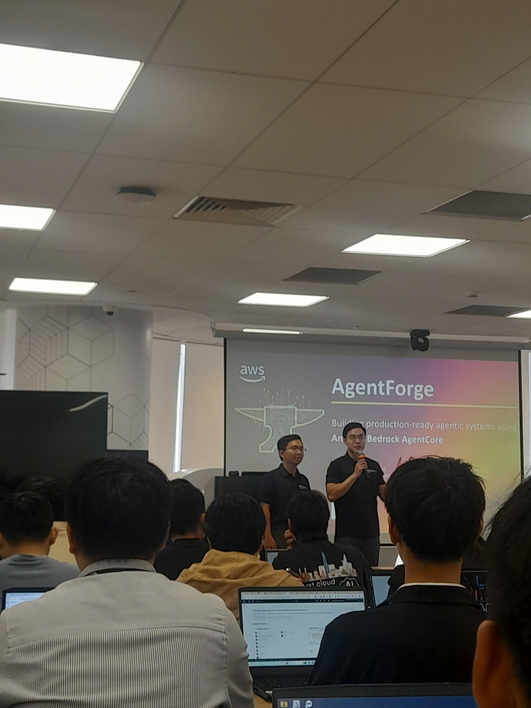
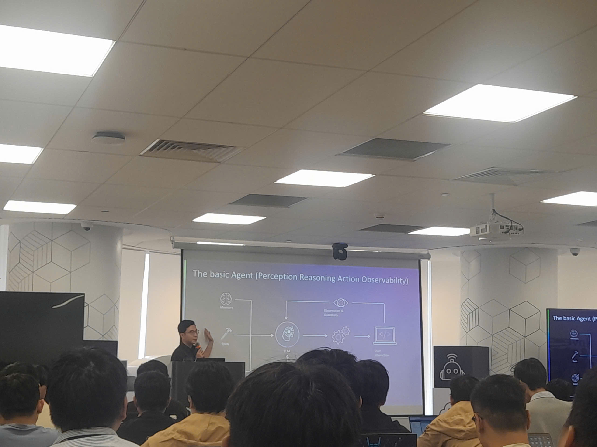
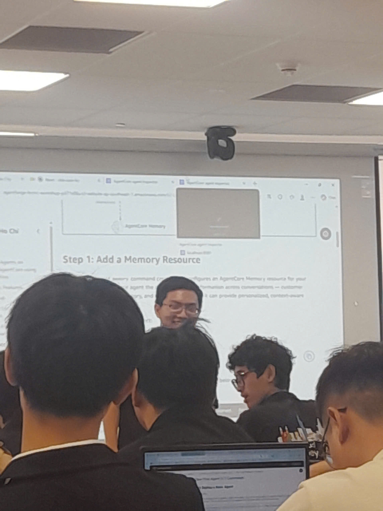

# Event Report: “Foundations & Agent Setup - Amazon Bedrock AgentCore”

### Purpose of the Event

- Provide foundational knowledge and steps for setting up an Agent (Foundations & Agent Setup).
- Introduce an overview of the architecture and core components of Amazon Bedrock AgentCore.
- Provide hands-on guidance (Hands-on Lab) for deploying an Agent, connecting tools, and integrating security.
- Help attendees familiarize themselves with the process of building a Web UI that interacts with an AI Agent.

### List of Speakers

- **Nghia Tran** - Speaker for the Workshop introduction & Amazon Bedrock AgentCore Overview
- **Anh Pham** - Instructor for the Hands-on Lab

### Key Highlights

#### Overview of Amazon Bedrock AgentCore (09:00 – 10:00)

Led by speaker Nghia Tran, this section focused on introducing the core architectural components of Bedrock AgentCore:
- **Runtime:** The execution environment and logic processing of AI Agents.
- **Gateway:** The intermediary communication gateway that receives and coordinates API requests.
- **Identity:** The mechanism for managing identity, security, and access rights to system resources.

#### Hands-on Lab (10:00 – 11:00)

Under the detailed guidance of Mr. Anh Pham, participants directly performed the following steps:
- **Deploy a basic agent:** Initialize and deploy a basic AI Agent in the AgentCore environment.
- **Integration:** Connect the Agent with external tools and Knowledge Bases to enhance information processing capabilities.
- **Web UI & Security:** Build a User Interface (Web UI) and integrate the Amazon Cognito service for user authentication.
- **Using Kuro:** Familiarize and apply the Kuro tool during the setup process.

### What I Learned

#### AI System Design Mindset

- Understand the lifecycle and operation of an Agent through the Runtime, Gateway, and Identity components.
- Grasp the method of connecting AI with enterprise data (Knowledge Bases) instead of relying solely on general language models.

#### Cloud Practical Skills

- Know how to operate directly on AWS to deploy a complete AI Agent.
- Understand the process of integrating Amazon Cognito into a Web UI, ensuring a secure Authentication flow according to standard practices.

### Application to Work

- **Backend Module Development:** Integrate knowledge about Identity flows and Amazon Cognito into the design and deployment of authorization and authentication modules (such as the AUTH module) for real-world software projects.
- **Building AI Features:** Apply Amazon Bedrock to research and develop automation features, smart chatbots, or data retrieval tools from Knowledge Bases.
- **Serverless Practice:** Leverage the rapid deployment mindset (deploy basic agent, external tools) to design leaner and more flexible Backend architectures.

### Event Experience

Attending the **“Foundations & Agent Setup”** event was a wonderful opportunity to take the first steps in getting acquainted with the AWS Generative AI ecosystem. Some highlight experiences:

#### Perfect Combination of Theory and Practice
- The presentation by Mr. **Nghia Tran** was very concise, making it easy for me to visualize the overall picture of AgentCore, especially how Runtime and Identity coordinate with each other.
- Right after, the Hands-on session by Mr. **Anh Pham** helped turn those theories into practical experiences, avoiding the initial confusion when getting used to a new platform.

#### Practical Technical Experience
- Personally **deploying a basic agent** and connecting it with **external tools** made me realize that integrating AI into current systems is not too complicated if the architecture is well grasped.
- In particular, the integration of **Amazon Cognito** into the Web UI was very useful for my Backend orientation, helping me reinforce my knowledge of user security system design.

#### Lessons Learned
- The combination of AI (Bedrock) and traditional management services (Cognito) opens up many new directions for building modern, highly secure applications.
- The **Kuro** IDE is an interesting tool that significantly optimizes the time spent building and integrating interfaces.

#### Some Photos from the Event
Photo 1: Opening the event

Photo 2: Sharing knowledge

Photo 3: Hands-on session

> Overall, the event brought very high practical value. The smooth transition from theoretical overview to personally deploying AI infrastructure not only supplemented my professional knowledge but also gave me a lot of motivation to pursue the Cloud Engineering path.